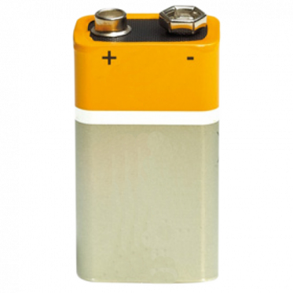

# Descriçao do Hardware

## Lista de Peças

Item                      | Valor
--------------------------| -----
1 [Arduino Uno](componentes/Arduino-uno.pdf)             | R$50,00
1 [Chassis (kit completo)](_imagens/chassi.jpg)  | R$50,00
2 [Motores DC](componentes/KIT-MOTOR-DC-3-6V-RODA-68MM.pdf)              | R$50,00
1 [Módulo Ponte H](componentes/ponte-H-dupla-baseado-no-chip-L298N.pdf)          | R$24,00
5 [Sensores LDR](componentes/LDR.pdf)            | R$15,00
5 [Resistores 10KOms](componentes/File-T--Technion_Israel-HardwarespecsResistors.pdf)       | R$3,50
1 [Bateria 9V](_imagens/bateria-9v.jpg)              | R$10,00
1 [Breadboard](componentes/Breadboard-roboromania.pdf)              | R$20,00
1 [Pacote de Jumpers](_imagens/jumpers.jpg)       | R$10,00
1 [Pacote de Solda](_imagens/tudo-solda.png)         | R$4,90
2 [Interruptor Liga/Desliga](_imagens/chave.png)| R$3,60
2 [Socket p/ 4 pilhas](componentes/Suporte-de-pilhas-suporta-4-pilhas-tamanho-AA.pdf)      | R$10,00
1 [Cabo Arduíno/Bateria 9V](_imagens/caa-0091-5750dad22dff52686c15124448980242-1024-1024.png) | R$4,60
2 [Pacotes c/4 pilhas cada](_imagens/pocote-4-pilha.jpg) | R$14,00
1 [BUZZER-5V](componentes/BUZZER-5V-COM-OSCILADOR-INTERNO.pdf)               | R$4,00
--------------------------|---------
Total                     | R$273,6

## Thinkercad

## Esquemático

Deve conter:

1) Lista de Peças (descrição e imagens, quando disponíveis)

2) Desenho Tinkercad ou Fritzing

3) Esquema eletrônico

4) Materiais para confecção de caixas e consoles (ou arquivos para impressão 3D)
