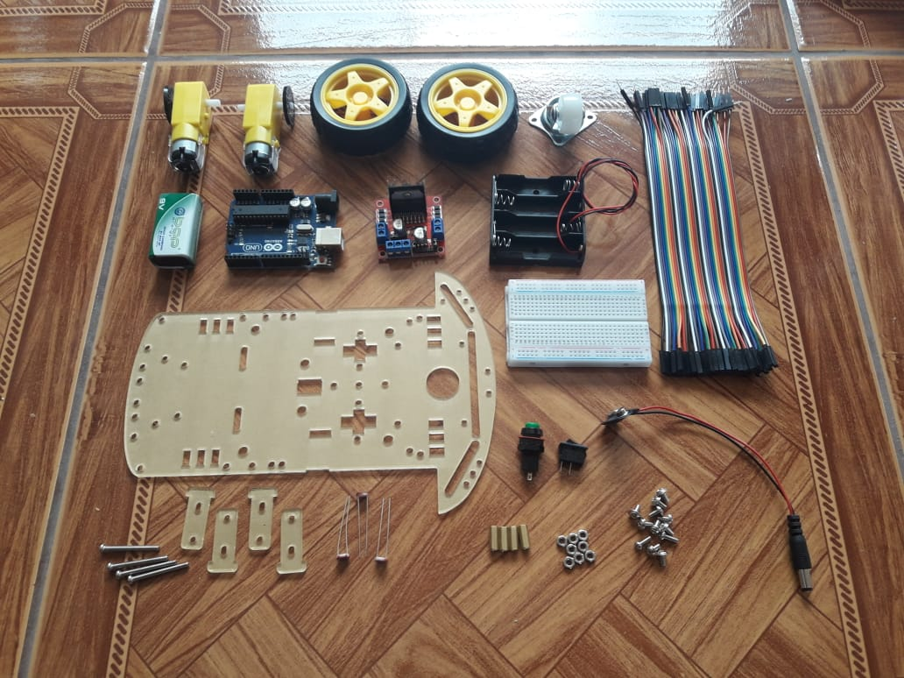
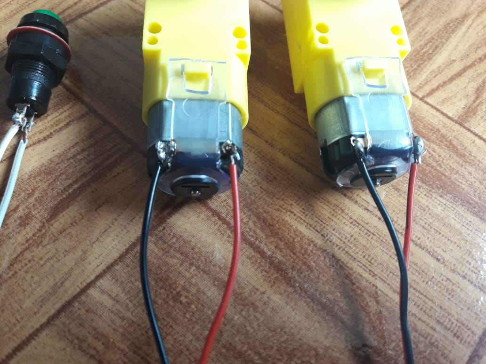
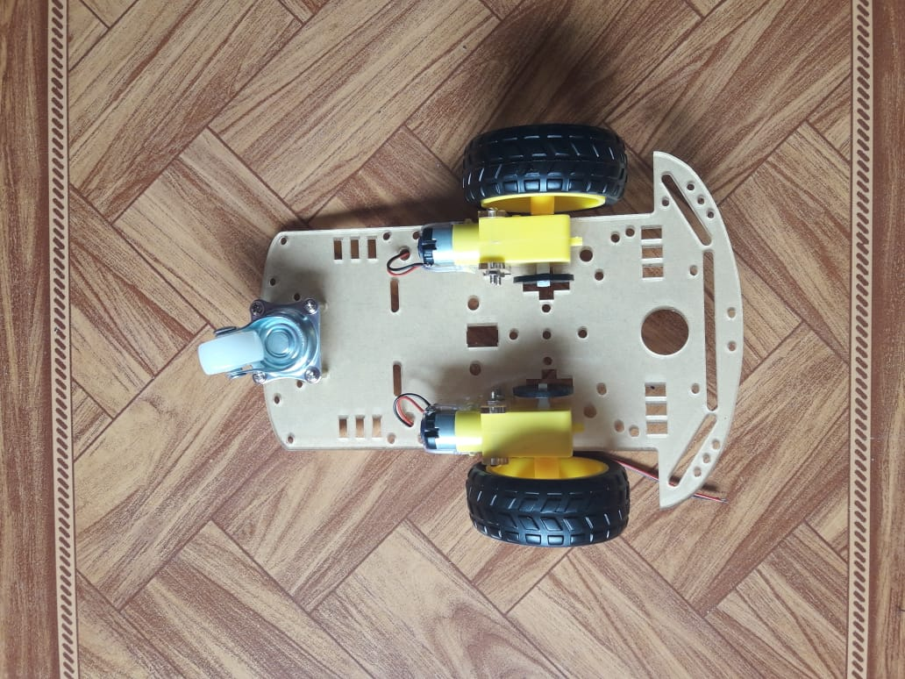
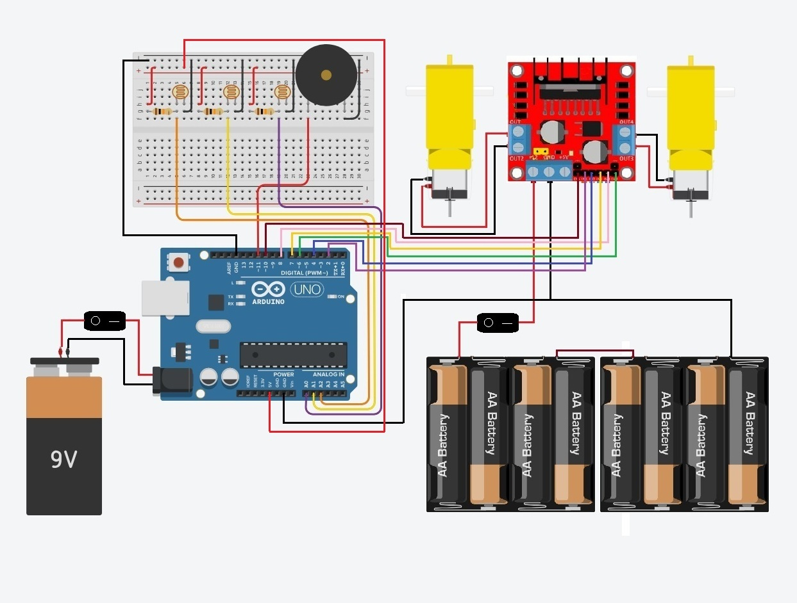
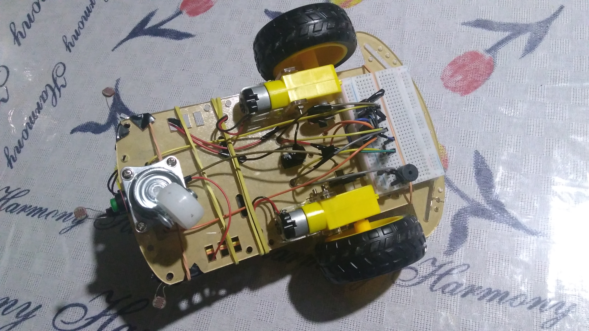
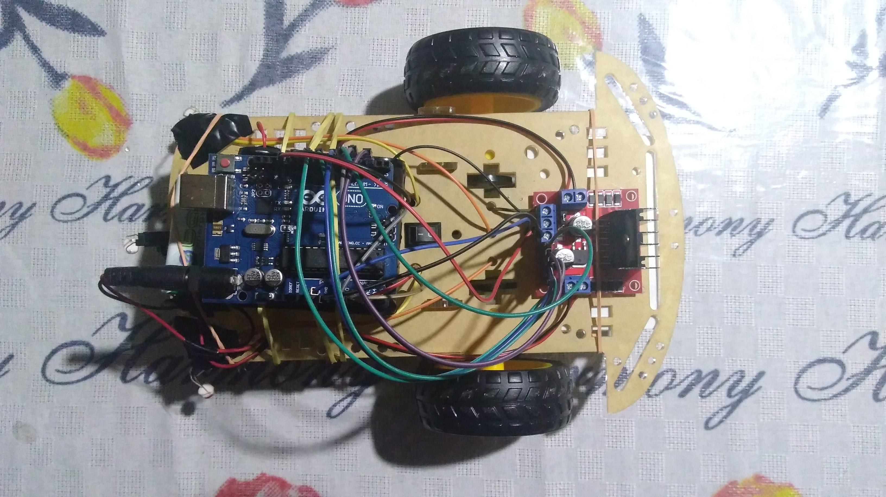
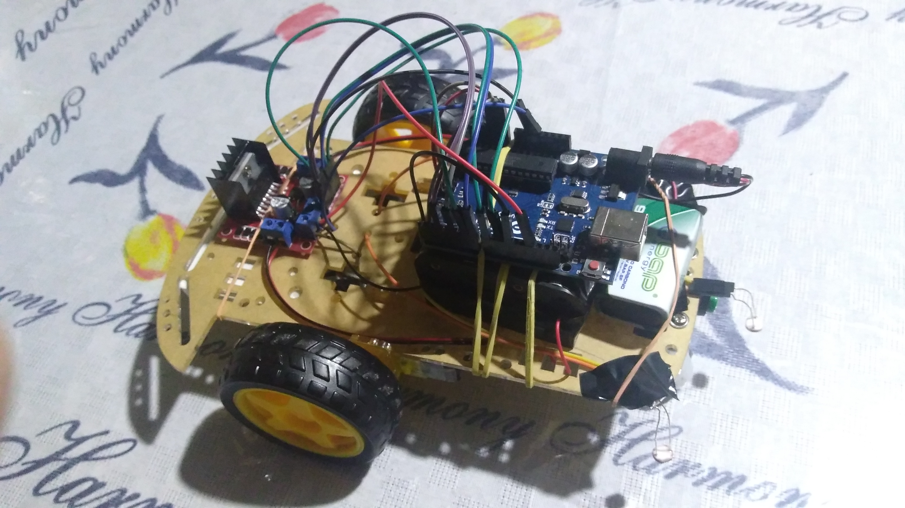

# Descrição do Processo de Montagem do Projeto

Para entendermos a construção e implementação do código no projeto, criamos um breve passo-a-passo por etapas, de maneira simples e objetiva:

## Componentes

## 1° passo - Soldar os componentes que precisam de solda 

Nesta etapa, soldamos os fios nos motores DC e interruptores liga/desliga, certificando a qualidade da solda. Uma solda bem feita é garantirá o bom funcionamento do carrinho.

## Componentes soldados

## 2° passo - Montando o kit do Chassi

Aqui, montamos o kit sem grandes dificuldades. Ao comprar o chassi, ele virá completo e com manual de montagem, caso fique alguma dúvida. Nessa etapa acoplamos os motores e rodas, além dos interruptores liga/desliga.

## Chassi montado

# Junção dos componentes eletrônicos no chassi

Com o chassi devidamente montado, motores, rodas e interruptores já acoplados, prosseguimos com a montagem. Dividimos a montagem dos componentes em duas etapas, superior e inferior. 

## Diagrama de ligação dos componentes

## 3° passo - Montando a parte de baixo do carrinho

Na parte de baixo do projeto, colocamos a Breadboard fixada com a própria fita dupla face que o componente dispõe. Na Breadboard, ligamos os sensores de Luminosidade LDR, os resistores de 10KOhms e o Buzzer de 5V. Aproveitamos também para passar os cabos para a parte superior do chassi.

## Parte inferior do carrinho

## 4° passo - Montando a parte de cima do carrinho

Para finalizá-lo, descreveremos aqui a montagem da parte superior do carrinho. Primeiro, acoplamos o módulo da Ponte H na parte traseira do carrinho, com um elástico de borracha, que é um material isolante. Em seguida, juntamos os dois Sockets para pilhas AA em série, somando o total de 12V (serão responsáveis pela alimentação da ponte H). Fixamos os Sockets na parte dianteira do carrinho, prendendo também com elásticos. Em cima dos Sockets prendemos o Arduino, um pouco mais a frente fixamos também a Bateria de 9V (responsável pela alimentação do Arduino). 

## Parte superior do carrinho

## 5° passo – Ajustando os sensores de luminosidade LDR

Por fim, prendemos os sensores de luminosidade LDR na parte da frente do carrinho, de modo a ficarem um no meio, um mais a direita e o outro mais a esquerda. Apontamos os sensores pra baixo, afim de obter a luz no chão.

## Sensores de luminosidade LDR devidamente ajustados

## Restaram dúvidas?
Caso possua alguma dúvida, você poderá assistir a este vídeo, onde o projeto muda um pouco, no entanto a montagem do circuito é idêntica: https://youtu.be/61M7Mg7KP6k
